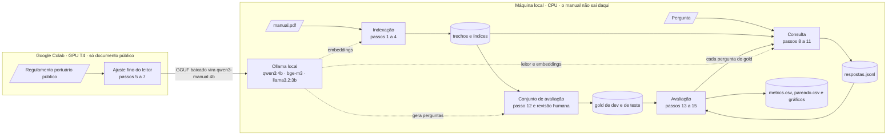
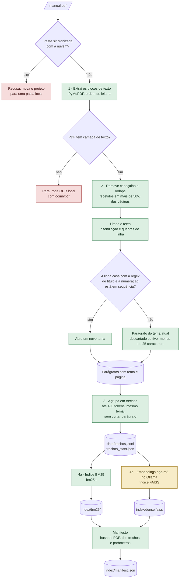
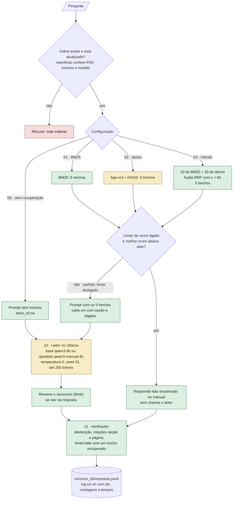
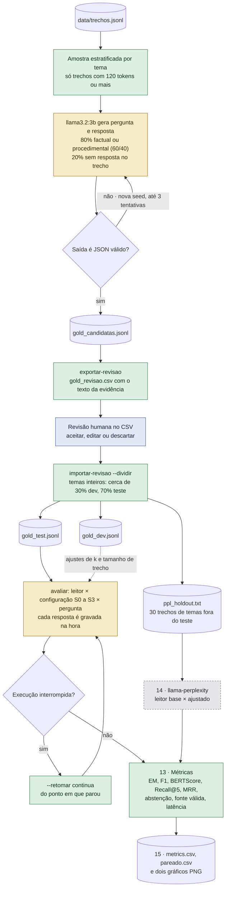
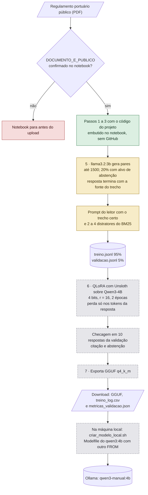

# Fluxograma do processo

Como o sistema funciona hoje, fase por fase. Os fluxos detalhados usam cores para a situação de cada etapa em 7 de
outubro de 2026:

| Cor | Situação |
|---|---|
| Verde | Verificada: testada com dados reais ou com lógica determinística conferida pelos testes |
| Amarelo | Pronta, mas testada só com simulação (depende de um modelo do Ollama que ainda não rodou) |
| Cinza tracejado | Pronta, ainda não executada (Colab e `llama-perplexity`) |
| Azul | Etapa humana |
| Vermelho | Recusa ou parada com mensagem que diz o que fazer |

## Visão geral

A máquina local faz tudo que envolve o manual; o Colab só recebe o documento público e devolve o modelo ajustado.

## Indexação (`qa-manual indexar`)

Do PDF aos índices. O PDF é lido antes de qualquer chamada ao Ollama.

## Consulta (`qa-manual perguntar`, e cada pergunta dentro do `avaliar`)

Uma pergunta, da recuperação ao registro. Só o recuperador e o leitor mudam entre as configurações.

## Conjunto de avaliação e avaliação (`gerar-perguntas` até `avaliar`)

Do conjunto de perguntas às métricas. A revisão humana fica entre a geração e a divisão.

## Ajuste fino no Colab (`colab/finetune_qlora.ipynb`)

O documento público vira pares de treino no formato do leitor; o modelo ajustado volta como GGUF.

## O que falta executar

- Etapas em amarelo: rodar com o Ollama real, começando pelo experimento mínimo (S0 e S3, leitor base, 30
  perguntas) com o manual público de [exemplos/porto_salvador/](exemplos/porto_salvador/).
- Etapas em cinza: rodar o notebook no Colab e compilar o `llama-perplexity`.
